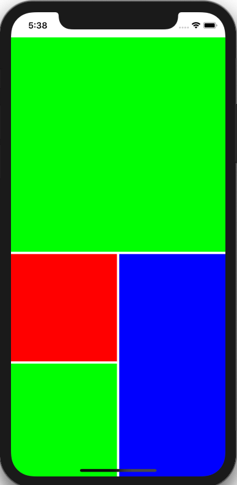

# StagLayout

[](https://cocoapods.org/pods/StagLayout)
[](https://cocoapods.org/pods/StagLayout)
[](https://cocoapods.org/pods/StagLayout)

Customizable UICollectionViewLayout that uses ratios (based on the collection view's width) to determine sizing of the cells. Only 2 max items per row are supported currently.




## Example

To run the example project, clone the repo, and run `pod install` from the Example directory first.

## Installation

StagLayout is available through [CocoaPods](https://cocoapods.org). To install
it, simply add the following line to your Podfile:

```ruby
pod 'StagLayout'
```

## Author

Inder Dhir, inderdhir@hotmail.com

## License

StagLayout is available under the MIT license. See the LICENSE file for more info.
